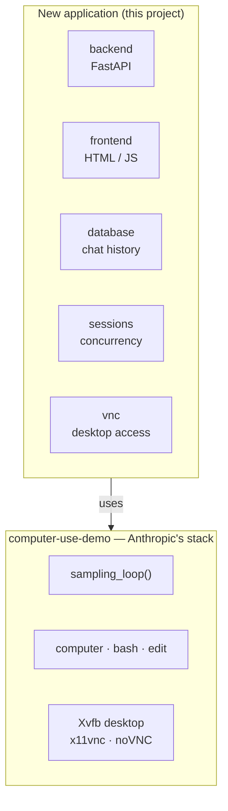

# Computer Use Agent Service

A FastAPI-based backend and web interface for an AI computer-use agent,
built by extending Anthropic's Computer Use Demo.

This repository started as a fork of Anthropic's Claude Quickstarts. The
only quickstart under active development here is the **Computer Use
Demo** (`computer-use-demo/`); the others are retained for reference.

## Goal

Anthropic's Computer Use Demo ships a working agent stack — the agent
loop, the Claude API integration, the computer/bash/edit tools, and a
containerised Linux desktop — behind a single-user Streamlit UI that
keeps all of its state in memory.

This project keeps that agent stack and builds a real service on top of
it: a FastAPI backend with session APIs, streamed progress, persisted
chat history, and support for several concurrent sessions.

## Requirements

1. **Reuse the existing computer-use agent stack** from
   [anthropic-quickstarts/computer-use-demo](https://github.com/anthropics/anthropic-quickstarts/tree/main/computer-use-demo)
   rather than reimplementing the loop or the tools.
2. **Replace the experimental Streamlit interface with a FastAPI
   backend** providing:
   - session creation and management APIs;
   - real-time progress streaming (WebSocket, SSE, or equivalent);
   - a VNC connection to the virtual machine;
   - database persistence for chat history;
   - support for simultaneous concurrent sessions without race
     conditions.
3. **Docker setup** for both local development and remote deployment.
4. **A simple frontend** (basic HTML/JS) that demonstrates the APIs.

## How it fits together

The new application sits on top of Anthropic's stack and drives it. The
upstream code stays where it is and is treated as a dependency, not as
something to fork line by line.



From the upstream stack we get the agent loop that talks to Claude and
executes tool calls, the three tools it drives, and a container image
running a Linux desktop with VNC already exposed. What it does not give
us is any way to reach that from outside a single Streamlit process —
no API, no persistence, and no notion of more than one session. That
gap is the project.

See [`docs/architecture.md`](docs/architecture.md) for the boundary
between the two layers and the design of each new component, and
[`docs/agent-loop.md`](docs/agent-loop.md) for how the upstream loop
works.

## Repository Layout

```
README.md
docs/                     Architecture and design notes
backend/                  NEW  FastAPI application
    api/                       route handlers
    sessions/                  session lifecycle and concurrency
    database/                  models and persistence
    streaming/                 progress events to clients
    vnc/                       desktop connection handling
    main.py
frontend/                 NEW  demo client
    index.html
    app.js
    style.css
docker/                   NEW  images and Compose setup
computer-use-demo/        Anthropic's existing stack
    Dockerfile                 Linux desktop image
    computer_use_demo/
        loop.py                the agent loop
        tools/                 computer, bash, edit
browser-use-demo/         reference only
agents/                   reference only
...
```

Only `computer-use-demo/` exists today; the directories marked NEW are
the work of this project.

## Getting Started

...

## Development

...

## Documentation

- [`docs/architecture.md`](docs/architecture.md) — how the new
  application layers onto the upstream stack, the constraints that
  layering inherits, and the design of each new component.
- [`docs/agent-loop.md`](docs/agent-loop.md) — how Anthropic's sampling
  loop drives Claude and the tools.
- `docs/api-design.md` — planned: endpoints, payloads, and the event
  schema for streamed progress.

## License

This project is based on Anthropic's Claude Quickstarts and retains the
applicable original license and notices.
