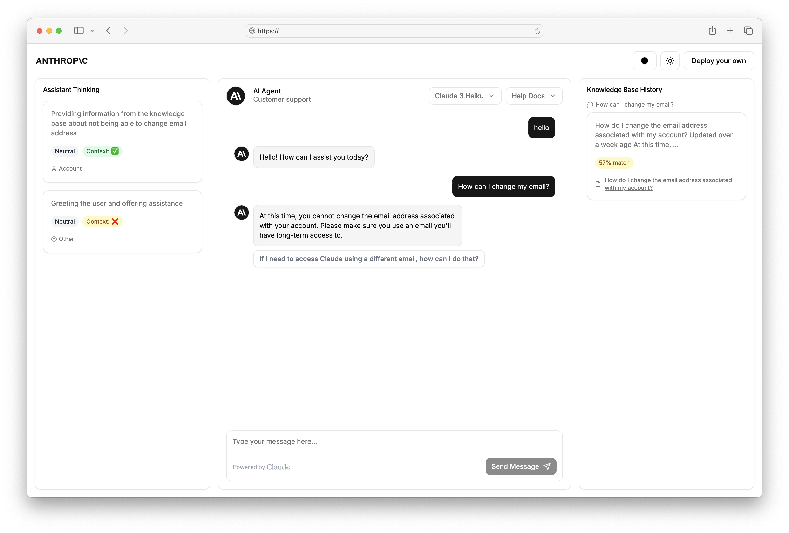
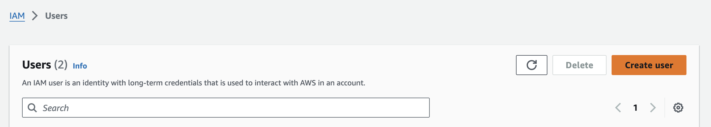
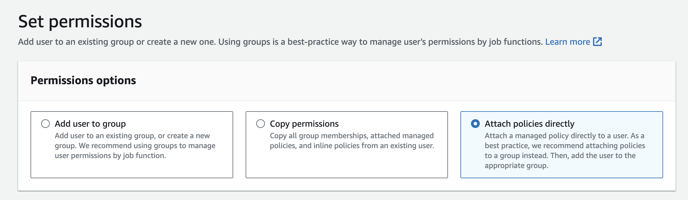
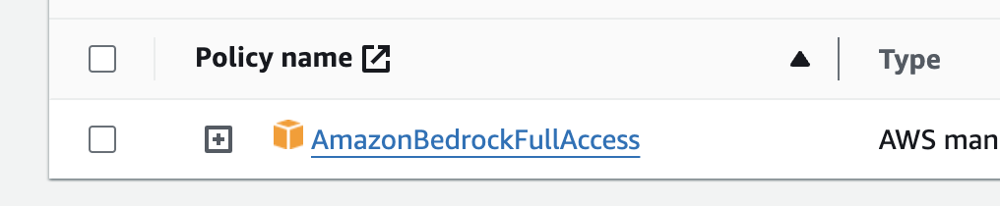
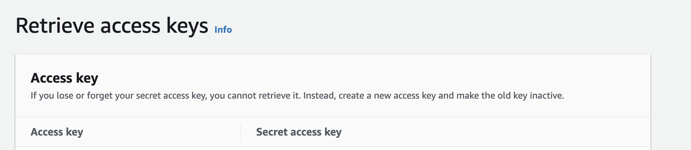
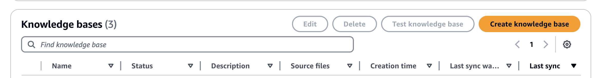
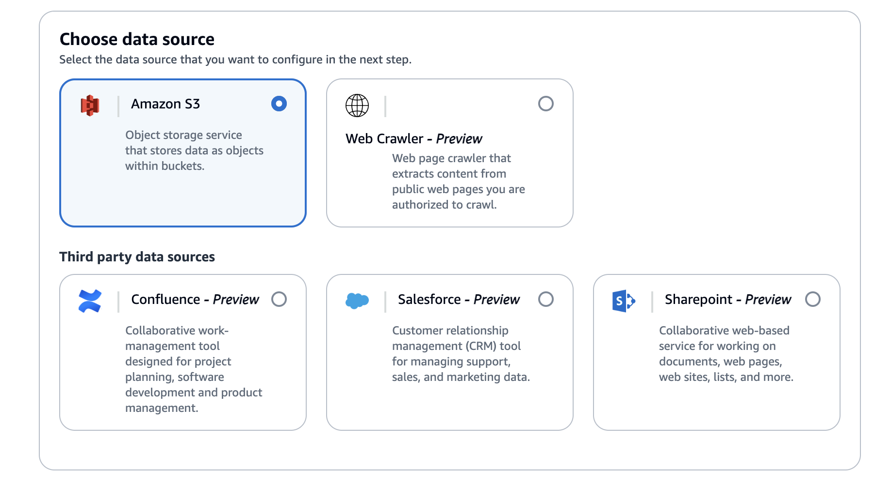

# Claude Customer Support Agent

An advanced, fully customizable customer support chat interface powered by Claude and leveraging Amazon Bedrock Knowledge Bases for knowledge retrieval.


## Key Features

-  AI-powered chat using Anthropic's Claude model
-  Amazon Bedrock integration for contextual knowledge retrieval
-  Real-time thinking & debug information display
-  Knowledge base source visualization
-  User mood detection & appropriate agent redirection
-  Highly customizable UI with shadcn/ui components

##  Getting Started

1. Clone this repository
2. Install dependencies: `npm install`
3. Set up your environment variables (see Configuration section)
4. Run the development server: `npm run dev`
5. Open [http://localhost:3000](http://localhost:3000) in your browser

## ⚙️ Configuration

Create a `.env.local` file in the root directory with the following variables:

```
ANTHROPIC_API_KEY=your_anthropic_api_key
BAWS_ACCESS_KEY_ID=your_aws_access_key
BAWS_SECRET_ACCESS_KEY=your_aws_secret_key
```

Note: We are adding a 'B' in front of the AWS environment variables for a reason that will be discussed later in the deployment section.

##  How to Get Your Keys

### Anthropic API Key

1. Visit [console.anthropic.com](https://console.anthropic.com/dashboard)
2. Sign up or log in to your account
3. Click on "Get API keys"
4. Copy the key and paste it into your `.env.local` file

### AWS Access Key and Secret Key

Follow these steps to obtain your AWS credentials:

1. Log in to the AWS Management Console
2. Navigate to the IAM (Identity and Access Management) dashboard

3. In the left sidebar, click on "Users"

4. Click "Create user" and follow the prompts to create a new user
   
5. On the Set Permission page, select the "Attach policies directly" policy
   
5. On the permissions page, use the "AmazonBedrockFullAccess" policy
   
6. Review and create the user
7. On the Summary page, click on Create access key.
8. Then select "Application running on an AWS compute service". Add a description if desired, then click "Create".
9. You will now see the Access Key ID and Secret Access Key displayed. Note that these keys are only visible once during creation, so be sure to save them securely.
   
8. Copy these keys and paste them into your `.env.local` file

Note: Make sure to keep your keys secure and never share them publicly.


##  Amazon Bedrock RAG Integration

This project utilizes Amazon Bedrock for Retrieval-Augmented Generation (RAG). To set up:

1. Ensure you have an AWS account with Bedrock access.
2. Create a Bedrock knowledge base in your desired AWS region.
3. Index your documents/sources in the knowledge base. For more info on that, check the "How to Create Your Own Knowledge Base" section.
4. In `ChatArea.tsx`, update the `knowledgeBases` array with your knowledge base IDs and names:

```typescript
const knowledgeBases: KnowledgeBase[] = [
  { id: "your-knowledge-base-id", name: "Your KB Name" },
  // Add more knowledge bases as needed
];
```

The application will use these knowledge bases for context retrieval during conversations.

### How to Create Your Own Knowledge Base

To create your own knowledge base:

1. Go to your AWS Console and select Amazon Bedrock.
2. In the left side menu, click on "Knowledge base" under "More".

3. Click on "Create knowledge base".
   
4. Give your knowledge base a name. You can leave "Create a new service role".
5. Choose a source for your knowledge base. In this example, we'll use Amazon S3 storage service.
   

   Note: If you're using the S3 storage service, you'll need to create a bucket first where you will upload your files. Alternatively, you can also upload your files after the creation of a knowledge base.

6. Click "Next".
7. Choose a location for your knowledge base. This can be S3 buckets, folders, or even single documents.
8. Click "Next".
9. Select your preferred embedding model. In this case, we'll use Titan Text Embeddings 2.
10. Select "Quick create a new vector store".
11. Confirm and create your knowledge base.
12. Once you have done this, get your knowledge base ID from the knowledge base overview.


##  Switching Models

This project supports multiple Claude models. To switch between models:

1. In `ChatArea.tsx`, the `models` array defines available models:

```typescript
const models: Model[] = [
  { id: "claude-3-haiku-20240307", name: "Claude 3 Haiku" },
  { id: "claude-3-5-sonnet-20240620", name: "Claude 3.5 Sonnet" },
  // Add more models as needed
];
```

2. The `selectedModel` state variable controls the currently selected model:

```typescript
const [selectedModel, setSelectedModel] = useState("claude-3-haiku-20240307");
```

3. To implement model switching in the UI, a dropdown component is used that updates the `selectedModel`.


##  Customization

This project leverages shadcn/ui components, offering a high degree of customization:

* Modify the UI components in the `components/ui` directory
* Adjust the theme in `app/globals.css`
* Customize the layout and functionality in individual component files
* Modify the theme colors and styles by editing the `styles/themes.js` file:

```javascript
// styles/themes.js
export const themes = {
  neutral: {
    light: {
      // Light mode colors for neutral theme
    },
    dark: {
      // Dark mode colors for neutral theme
    }
  },
  // Add more themes here
};
```
You can add new themes or modify existing ones by adjusting the color values in this file.

## Deploy with Vercel

[](https://vercel.com/new/clone?repository-url=https%3A%2F%2Fgithub.com%2Fanthropics%2Fanthropic-quickstarts%2Ftree%2Fmain%2Fcustomer-support-agent&env=ANTHROPIC_API_KEY,BAWS_ACCESS_KEY_ID,BAWS_SECRET_ACCESS_KEY&envDescription=See%20the%20README%20for%20instructions%20to%20get%20your%20keys&envLink=https%3A%2F%2Fgithub.com%2Fanthropics%2Fanthropic-quickstarts%2Ftree%2Fmain%2Fcustomer-support-agent%23how-to-get-your-keys&project-name=customer-support-agent&repository-name=customer-support-agent&demo-title=Anthropic%20Quickstarts%3A%20Customer%20Support%20Agent&demo-description=This%20project%20demonstrates%20how%20to%20leverage%20Claude's%20natural%20language%20understanding%20and%20generation%20capabilities%20to%20create%20an%20AI-assisted%20customer%20support%20system%20with%20access%20to%20a%20knowledge%20base.&demo-url=https%3A%2F%2Fgithub.com%2Fanthropics%2Fanthropic-quickstarts%2Ftree%2Fmain%2Fcustomer-support-agent)

To deploy this application using Vercel, follow these steps. 

1. Follow [the steps above](#how-to-get-your-keys) to get your required keys

```
ANTHROPIC_API_KEY=your_anthropic_api_key
BAWS_ACCESS_KEY_ID=your_aws_access_key
BAWS_SECRET_ACCESS_KEY=your_aws_secret_key
```

2. Click the Deploy Button and follow the new project creation flow.


##  Deploy with AWS Amplify

To deploy this application using AWS Amplify, follow these steps:

1. Go to your AWS Console and select Amplify.
2. Click on "Create new app" (image link to be added later).
3. Select GitHub (or your preferred provider) as the source.
4. Choose this repository.
5. Edit the YAML file to contain:

   ```yaml
   version: 1
   frontend:
     phases:
       preBuild:
         commands:
           - npm ci --cache .npm --prefer-offline
       build:
         commands:
           - npm run build # Next.js build runs first
           - echo "ANTHROPIC_API_KEY=$ANTHROPIC_API_KEY" >> .env
           - echo "KNOWLEDGE_BASE_ID=$KNOWLEDGE_BASE_ID" >> .env
           - echo "BAWS_ACCESS_KEY_ID=$BAWS_ACCESS_KEY_ID" >> .env
           - echo "BAWS_SECRET_ACCESS_KEY=$BAWS_SECRET_ACCESS_KEY" >> .env
     artifacts:
       baseDirectory: .next
       files:
         - "**/*"
     cache:
       paths:
         - .next/cache/**/*
         - .npm/**/*
   ```

6. Choose to create a new service role or use an existing one. Refer to the "Service Role" section for more information.
7. Click on "Advanced settings" and add your environmental variables:

   ```
   ANTHROPIC_API_KEY=your_anthropic_api_key
   BAWS_ACCESS_KEY_ID=your_aws_access_key
   BAWS_SECRET_ACCESS_KEY=your_aws_secret_key
   ```
   The reason we are adding a 'B' in front of the keys here is because AWS doesn't allow keys in Amplify to start with "AWS".

8. Click "Save and deploy" to start the deployment process.

Your application will now be deployed using AWS Amplify.


### Service Role

Once your application is deployed, if you selected to create a new service role:

1. Go to your deployments page
2. Select the deployment you just created
3. Click on "App settings"
4. Copy the Service role ARN
5. Go to the IAM console and find this role
6. Attach the "AmazonBedrockFullAccess" policy to the role

This ensures that your Amplify app has the necessary permissions to interact with Amazon Bedrock.

##  Customized Deployment and Development
This project now supports flexible deployment and development configurations, allowing you to include or exclude specific components (left sidebar, right sidebar) based on your needs.
Configuration
The inclusion of sidebars is controlled by a config.ts file, which uses environment variables to set the configuration:
```typescript
typescriptCopytype Config = {
  includeLeftSidebar: boolean;
  includeRightSidebar: boolean;
};

const config: Config = {
  includeLeftSidebar: process.env.NEXT_PUBLIC_INCLUDE_LEFT_SIDEBAR === "true",
  includeRightSidebar: process.env.NEXT_PUBLIC_INCLUDE_RIGHT_SIDEBAR === "true",
};

export default config;
```

This configuration uses two environment variables:

NEXT_PUBLIC_INCLUDE_LEFT_SIDEBAR: Set to "true" to include the left sidebar
NEXT_PUBLIC_INCLUDE_RIGHT_SIDEBAR: Set to "true" to include the right sidebar

## NPM Scripts
The package.json includes several new scripts for different configurations:

```bash
npm run dev: Runs the full app with both sidebars (default)
npm run build: Builds the full app with both sidebars (default)
npm run dev:full: Same as npm run dev
npm run dev:left: Runs the app with only the left sidebar
npm run dev:right: Runs the app with only the right sidebar
npm run dev:chat: Runs the app with just the chat area (no sidebars)
npm run build:full: Same as npm run build
npm run build:left: Builds the app with only the left sidebar
npm run build:right: Builds the app with only the right sidebar
npm run build:chat: Builds the app with just the chat area (no sidebars)
```

Usage
To use a specific configuration:

For development: Run the desired script (e.g., npm run dev:left)
For production: Build with the desired script (e.g., npm run build:right)

These scripts set the appropriate environment variables before running or building the application, allowing you to easily switch between different configurations.
This flexibility allows you to tailor the application's layout to your specific needs, whether for testing, development, or production deployment.

## Appendix

This project is a prototype and is provided on an "as-is" basis. It is not intended for production use and may contain bugs, errors, or inconsistencies. By using this prototype, you acknowledge and agree that:
- The software is provided in a pre-release, beta, or trial form.
- It may not be suitable for production or mission-critical environments.
- The developers are not responsible for any issues, data loss, or damages resulting from its use.
- No warranties or guarantees of any kind are provided, either expressed or implied.
- Support for this prototype may be limited or unavailable.
- Use of this prototype is at your own risk. We encourage you to report any issues or provide feedback to help improve future versions.
