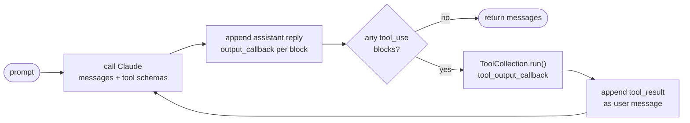

# The agent loop

`sampling_loop()` in `computer-use-demo/computer_use_demo/loop.py` is
the piece of Anthropic's stack we reuse unchanged. It takes a
conversation and runs it to completion, calling Claude and executing
whatever tools Claude asks for until the task is done.

This document describes what it does and where our backend attaches to
it.

## The cycle

It is a single `while True` over the message list:

1. **Ask Claude.** Send the whole conversation plus the tool schemas,
   with the beta flag matching the selected tool version.
2. **Record the reply.** Append the assistant message to the list, and
   hand each content block to `output_callback` so a UI can render it as
   it arrives.
3. **Run the tools.** Execute every `tool_use` block through
   `ToolCollection`, which dispatches to `computer`, `bash`, or
   `str_replace_based_edit_tool`. Each result goes to
   `tool_output_callback`.
4. **Feed the results back.** Append the `tool_result` blocks — text and
   base64 PNG screenshots — as a new user message.
5. **Repeat** until Claude replies without requesting a tool.

The message list is mutated in place throughout, and it is also the
return value. That matters for us: it means the list belongs to exactly
one running loop, and it is the thing to persist.

## Callbacks

Three callbacks are the loop's only way of reporting progress. They fire
synchronously, inside the loop, as things happen — which makes them the
attachment point for the backend's event stream.

| Callback | Fires when | Carries |
| --- | --- | --- |
| `output_callback` | Each content block of an assistant reply | Text, thinking, or tool-use blocks |
| `tool_output_callback` | Each tool finishes | `ToolResult` (output, error, screenshot) and the tool-use id |
| `api_response_callback` | Every API exchange, including failures | Raw HTTP request and response, or the exception |

## Context management

Screenshots dominate the context in a computer-use conversation, so the
loop manages it in two ways:

- **Prompt caching**, enabled for the Anthropic provider. Cache
  breakpoints are set on the three most recent user turns plus the
  system prompt.
- **Image truncation** via `only_n_most_recent_images`, which drops all
  but the most recent *N* screenshots, in chunks, to avoid breaking the
  cache more often than necessary.

These interact: when prompt caching is on, truncation is disabled, on
the reasoning that cached reads are cheap enough that breaking the cache
to save tokens is a bad trade.

## Configuration

- **Tool versions.** `tools/groups.py` pairs each tool version with its
  API beta flag, so the schemas stay in step with the model.
- **Providers.** Anthropic, Bedrock, or Vertex, selected per call.
  Prompt caching is only enabled for Anthropic.
- **Thinking.** `adaptive` for newer models, which take an effort level
  and decide for themselves; `extended` for older ones, which take a
  token budget; or `off`.

## Termination and failure

The loop returns the message list in every case. It ends normally when
Claude replies without requesting a tool. On an API error it reports
through `api_response_callback` and returns immediately — the exception
does not propagate.

There is no cancellation path. Once started, the loop runs until the
task finishes or the API fails, so stopping a session early is something
the backend has to impose from outside.
