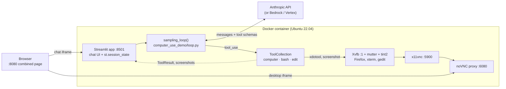

# Architecture

The design record for this project. The README covers what we are
building and why; this document covers how the new application attaches
to Anthropic's stack, what that inheritance constrains, and what each
new component has to do.

Sections marked **Open** are decisions that have not been made yet.

## The boundary

The new application uses `computer-use-demo/` as a dependency. Upstream
code is not forked or edited; we call into it. That keeps us able to
pull upstream changes, and it keeps the interesting logic — sessions,
persistence, streaming — in code we own.

The seam is narrow. Everything we need from upstream is reachable
through one function and one class:

- `sampling_loop()` in `computer_use_demo/loop.py` runs a task to
  completion, reporting progress through three callbacks.
- `ToolCollection` in `computer_use_demo/tools/` executes the tool calls
  the model requests.

Our side supplies the message history, the API credentials, and the
callbacks; upstream supplies the loop and the tools. See
[`agent-loop.md`](agent-loop.md) for what happens between those calls.

### Open: deployment topology

This is the decision everything else hangs off, and it is not obvious,
because the upstream tools act on *the machine they run on*. `bash`
spawns a shell locally, `edit` reads and writes the local filesystem,
and `computer` drives the local X display. There is no remote-execution
path built in.

Three options, with what each costs:

**A — Backend inside the desktop container, one container per session.**
The loop runs in-process, so upstream is imported directly and nothing
needs a transport. But each container then exposes its own API, so
something in front has to route callers to the right one, and "session
management" becomes container orchestration. Shared state — the
database, the session index — has to live outside the containers.

**B — Backend outside, one desktop container per session.** One backend
service, cleanly scalable, with the database and session registry local
to it. The cost is that the tools have to run inside the desktop
container while the loop runs outside it, so this needs a small shim in
the image that accepts tool calls over the network and executes them
against the local display. That shim is the main piece of new work in
this option.

**C — Backend outside, one shared desktop container with several X
displays.** Cheapest on resources. But `ComputerTool` reads
`DISPLAY_NUM`, `WIDTH`, and `HEIGHT` from the process environment when
it is constructed, and the environment is process-global, so two
concurrent sessions in one process get the same desktop. Worse, `bash`
and `edit` would share one filesystem across sessions, so tasks could
interfere with each other. Isolation here is weak enough that it is
probably only suitable for a demo.

A related detail that affects A and B: `computer-use-demo/pyproject.toml`
declares only tooling config — there is no `[project]` table and no
build backend, so `computer_use_demo` is not an installable package. It
is imported today by running from inside that directory, and the
hyphenated parent directory means it cannot be imported from the repo
root as-is. Whichever topology we pick, importing upstream needs either
a small packaging shim or an explicit path setup.

## Baseline: Anthropic's Computer Use Demo

Everything upstream runs inside one container: the agent, the tools it
calls, and the Linux desktop those tools drive.

### The tools

| Tool | Implementation |
| --- | --- |
| `computer` | Mouse, keyboard, and screenshots via `xdotool` and `gnome-screenshot`/`scrot` against `DISPLAY=:1` |
| `bash` | A persistent shell subprocess, held per tool instance |
| `str_replace_based_edit_tool` | Direct reads and writes on the local filesystem |

Tools are grouped into versioned sets in `tools/groups.py` so the
schemas stay in step with the model and its API beta flag. A fresh
`ToolCollection` is constructed on every `sampling_loop()` call, so tool
instances — including the bash subprocess — are per-invocation rather
than global.

### Processes and ports

| Port | Process | Role |
| --- | --- | --- |
| 8080 | `http_server.py` | Static page embedding the two iframes below |
| 8501 | Streamlit | Chat UI and all session state |
| 6080 | noVNC | Desktop in the browser (`/vnc.html`) |
| 5900 | x11vnc | Raw VNC for native clients |

`image/entrypoint.sh` starts the X stack, then noVNC, then Streamlit.

## Constraints inherited from the baseline

The agent stack is sound; the shell around it is what we are replacing.
Each of these is a requirement in disguise.

- **State is in memory, per browser session.** Conversation, tool
  results, and raw API responses live in `st.session_state`. One
  browser session is one agent, and nothing outside the process can see
  it.
- **Nothing is persisted.** Chat history dies with the process; only the
  API key and custom system prompt are written to `~/.anthropic/`.
- **There is no API.** The loop is driven from a Streamlit callback, so
  no other program can start a task or observe one.
- **Progress is reported by callback, not by stream.** `output_callback`,
  `tool_output_callback`, and `api_response_callback` fire synchronously
  inside the loop. They are the natural attachment point for our event
  stream, but something has to bridge them to a transport.
- **The tools are local and the desktop is singular.** Covered above; it
  is the reason concurrency has to be solved at the container or display
  level rather than with async alone.
- **The loop runs until the task ends.** `sampling_loop()` returns only
  when Claude stops requesting tools. Cancelling a running session is
  not something upstream supports, so we have to impose it from outside.

## Reuse, replace, add

| Upstream component | Plan |
| --- | --- |
| `sampling_loop()` | Reuse; drive it from the backend and bridge its callbacks into the event stream |
| `computer` / `bash` / `edit` tools | Reuse unchanged |
| Claude API integration and tool versioning | Reuse unchanged |
| Xvfb + x11vnc + noVNC desktop image | Reuse; provision per session |
| Streamlit UI | Replace with the FastAPI backend and the HTML/JS frontend |
| `st.session_state` | Replace with the session manager and the database |

## New components

### Session manager

Owns the lifecycle: create, look up, list, cancel, destroy. A session
pairs a conversation with a desktop, so creating one has to provision
or claim a desktop and release it on teardown.

This is where the concurrency requirement is actually met, so it needs
to be explicit about what is shared. The message list passed to
`sampling_loop()` is mutated in place as the loop runs, so it must
belong to exactly one session and one running task. Two requests
against the same session — a second prompt arriving while the loop is
still going, or a cancel racing a completion — are the cases to design
against.

**Open:** whether a second prompt to a busy session queues, is rejected,
or interrupts.

### Database

Persists chat history so it survives restarts and can be read by a
client that was not connected when the task ran.

Three tables: `sessions`, `events`, and `workers` — the last being the
pool registry the session manager claims from. Postgres in deployment,
SQLite in tests, reached through SQLAlchemy's async engine.

Every event carries a `seq`, its position in its session. Positions are
handed out by incrementing a counter on the session row in the UPDATE
itself and returning the result, so two writers appending at once get
disjoint ranges instead of both reading the same maximum. A unique
constraint on `(session_id, seq)` is the backstop. This matters because
the stream and the persisted history have to agree on ordering for a
reconnecting client to resume without gaps or repeats.

Screenshots arrive as base64 PNGs inside tool results, and they are
large and frequent. They are written to a blob store on the way in and
the row keeps only a reference, so reading history stays cheap for the
common case of wanting the text. The store is content-addressed by
digest, which collapses the many identical screenshots a run produces
when the screen does not change between steps.

**Deferred:** migrations. Tables are created directly while the schema
is still moving; a migration tool is the right answer once it settles.

### Streaming

`GET /sessions/{id}/events` is an SSE stream. A client that connects
late, or drops and comes back, starts from a `seq` (`from` or
`Last-Event-ID`) and is replayed out of the database, then handed to a
per-session bus for events that have not happened yet. The stream and
the rows agree on order because they share `seq`: the bus is subscribed
before history is read, so an event persisted during that read cannot
open a gap, and anything already yielded is skipped on the live tail.

The stream stays open across runs. A session can be prompted more than
once, and closing on `run_finished` would force every client to
reconnect for the next prompt.

A subscriber that falls behind is dropped rather than allowed to grow
an unbounded queue; it reconnects and replays. Idle connections get a
comment keepalive so proxies do not close them.

### VNC

Gives the client a view of the desktop for its session. The upstream
image already exposes x11vnc on 5900 and noVNC on 6080, so this is
mostly routing: map a session to its desktop endpoint and hand the
client something it can connect to.

**Open:** whether the backend proxies the VNC connection or hands out a
direct endpoint. Proxying keeps ports closed and lets the backend
enforce access; direct is simpler and faster.

### Frontend

A small HTML/JS client that demonstrates the APIs: create a session,
send a prompt, watch progress arrive, and see the desktop alongside it.
Deliberately plain — it is a demonstration of the backend, not a product
surface.

## Open decisions

Collected from above, roughly in the order they need answering:

1. Deployment topology (A, B, or C) — determines the concurrency model,
   the Docker layout, and VNC routing.
2. How upstream gets imported, given it is not a package.
3. Behaviour when a prompt arrives for a session that is already running.
