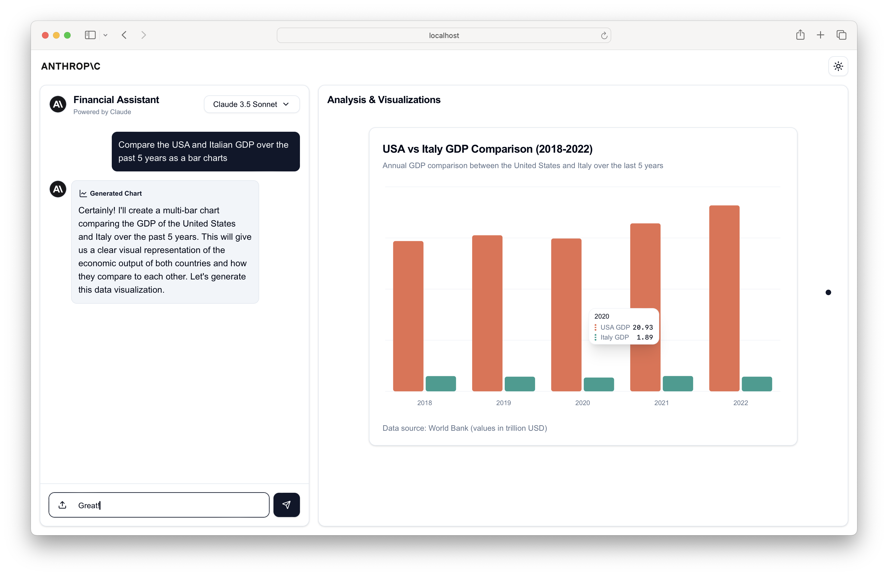

# Claude Financial Data Analyst



A sophisticated Next.js application that combines Claude's capabilities with interactive data visualization to analyze financial data via chat.

## Features

- **Intelligent Data Analysis**: Powered by Claude (Using Claude 3 Haiku & Claude 3.5 Sonnet)
- **Multi-Format File Upload Support**:
  - Text/Code files (.txt, .md, .html, .py, .csv, etc)
  - PDF documents (Regular PDF with text, scanned documents not supported)
  - Images
- **Interactive Data Visualization**: Based on the context and data analyzed, Claude can generate the following charts:
  - Line Charts (Time series data & trends)
  - Bar Charts (Single metric comparisons)
  - Multi-Bar Charts (Multiple metrics comparison)
  - Area Charts (Volume/quantity over time)
  - Stacked Area Charts (Component breakdowns)
  - Pie Charts (Distribution analysis)

## Getting Started

### Prerequisites

- Node.js 18+ installed
- Anthropic API key (For Claude integration)

### Installation

1. Clone the repository:
```bash
git clone https://github.com/yourusername/financial-ai-assistant.git
cd financial-ai-assistant
```

2. Install dependencies:
```bash
npm install
```

3. Create a `.env.local` file in the root directory:
```env
ANTHROPIC_API_KEY=your_api_key_here
```

4. Run the development server:
```bash
npm run dev
```

Open [http://localhost:3000](http://localhost:3000) with your browser to see the result.

## Technology Stack

- **Frontend**:
  - Next.js 14
  - React
  - TailwindCSS
  - Shadcn/ui Components
  - Recharts (For data visualization)
  - PDF.js (For PDF processing)

- **Backend**:
  - Next.js API Routes
  - Edge Runtime
  - Anthropic SDK

## Usage Examples

The assistant can help with various financial analysis tasks:

1. **Data Extraction & Analysis**:
   - Upload financial documents
   - Extract key metrics
   - Analyze trends and patterns

2. **Visualization Creation**:
   - Generate charts based on data
   - Customize visualizations
   - Compare multiple metrics

3. **Interactive Analysis**:
   - Ask questions about the data
   - Request specific visualizations
   - Get detailed explanations

## Interesting Use Cases

While primarily designed for financial analysis, the AI assistant can be adapted for various intriguing applications:

1. **Environmental Data Analysis**:
   - Analyze climate change trends
   - Visualize pollution levels over time
   - Compare renewable energy adoption across regions

2. **Sports Performance Tracking**:
   - Upload athlete performance data
   - Generate visualizations of key metrics
   - Analyze trends and patterns in team statistics

3. **Social Media Analytics**:
   - Process engagement data from various platforms
   - Create charts showing follower growth and interaction rates
   - Analyze sentiment trends in user comments

4. **Educational Progress Tracking**:
   - Upload student performance data
   - Visualize learning progress over time
   - Compare different teaching methods or curriculums

5. **Health and Fitness Monitoring**:
   - Process personal health data from wearables
   - Create charts for metrics like steps, heart rate, and sleep patterns
   - Analyze long-term health trends and provide insights

You can even use charts and images to create interesting results, like the ability to see what's most common inside a picture using a pie chart.


